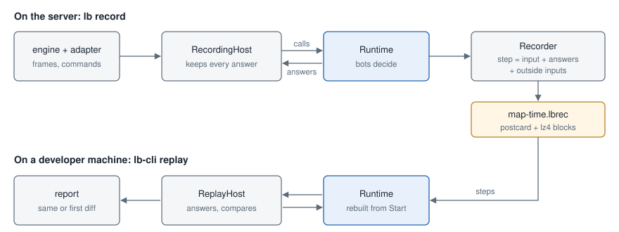

# Recording and replay

A recording keeps a map's session exactly as the core lived it. `lb-cli replay` runs it again through a fresh core on
any machine and checks that the bots decide the same, command for command. Use it to:

- take a bot's misstep home from a server;
- step through it with logs or a debugger;
- confirm that a fix changes that decision and nothing else.



## Recording

| Command                     | Action                                                    |
|-----------------------------|-----------------------------------------------------------|
| `lb record start [seconds]` | record the next map, for `seconds` of it or until it ends |
| `lb record`                 | what the recorder is doing: file, frames, seconds, size   |
| `lb record stop`            | stop and close the file                                   |

A recording starts with a map: after `lb record start`, run `changelevel <map>` or `restart`. The core keeps little
from one map to the next, so a recording can begin there with a small snapshot; mid-map it would need the whole state
of every bot.

The file is `addons/lambdabots/records/<map>-<YYYYMMDD-HHMMSS>.lbrec`. A recording also closes on its own:

- when the map ends;
- when the server shuts down;
- past 4 GiB of uncompressed data;
- after a core panic. The last step is then the one that panicked, and a replay runs into the same panic.

Size on the macOS stand (crossfire, 1000 fps, 4 bots): 34 MB for 3 minutes. That is about 190 KB/s on disk and
about 5 MB/s before compression, so the 4 GiB cap comes after 13–14 minutes.

## Replay

```sh
lb-cli replay addons/lambdabots/records/crossfire-20260927-170816.lbrec
```

| Option        | Meaning                                                                      |
|---------------|------------------------------------------------------------------------------|
| `--console`   | print the core's console output while replaying                              |
| `--diffs <n>` | list up to `n` differing decisions (default 20)                              |
| `--dir <dir>` | make a new directory there for the recorded files (default: the system temp) |
| `--keep`      | keep the unpacked files and the replay's logs                                |

The exit code is:

- 0 when every decision matches;
- 1 when a decision differs or the replay diverged;
- 2 when the file cannot be read.

The report gives the number of frames and of bot commands compared. It lists the first differing decisions with
their frame numbers and, if the replay left the recording, where and why.

A replay reproduces the build that made the recording. Replay with `lb-cli` built from the same source as the
server's plugin: a change in the code changes decisions, and the replay reports them. It does not warn when the
source differs, only when the core version number does.

## What a recording holds

**Start**, once:
- how the core was started (paths, platform), and what the host answered while the runtime was created;
- what the runtime carries over a map change:
  - the config with console changes, the telemetry secret left out;
  - cvar values and interned strings;
  - personalities that come back and those asked for with `lb add`;
  - the master seed and the random state;
  - the chat's state: the players in the game when the last map ended, the talks under way, the bots' recent lines,
    when each nickname was last on the server (for greetings), the gist of players' recent lines and the bots asked
    to answer them (for repeats) and the hourly cap of lines nobody asked for;
- the files the runtime reads:
  - `config/lambdabots.yaml`, `config/difficulty.yaml`, `config/styles/`;
  - `profiles/`, `names/`, `data/profiles.yaml`;
  - the map's BSP, its navigation graph and its overlays (`maps/<map>/editor.yaml`, `overlay.yaml`);
  - not `config/chat/` or `data/chat/`: only the chat worker reads them;
- a hash of what the runtime made of those files. A replay warns if its own differs.

**Steps**, one per call of the adapter into the core (map start, frame start and end, console command). Each step
holds:
- what came in: the frame input exactly as the adapter passed it (header, player snapshots, own bots, the event
  arena), or the command's words;
- every answer the host gave while the core ran:
  - trace and contents results;
  - cvar values, entity snapshots and weapon data;
  - the outcome of creating a bot, and the feedback of the moves;
- what the runtime took from outside the engine: the frame at which the navigation loader had finished, commands
  from the telemetry command channel, and the chat worker's replies (`docs/chat.md`): the model's lines and the ready
  phrases the bots then type, silences (a line the filter dropped among them) and failures.

Calls without an answer are not kept: prints, server commands, debug drawing. The core makes some of them from log
lines, which other threads write at their own pace.

**End**: why the recording stopped, with its step and frame counts.

The telemetry secret and the chat key are not kept: in the carried config, in `config/lambdabots.yaml` and in the
values of `lb_telemetry_secret` they are stored as `<redacted>` (`chat.provider.api_key`, and the values of
`chat.provider.headers`, which may hold a gateway's key). A replay opens no sockets, so it needs neither. The recorded
`lambdabots.yaml` is written back from what it parses to, without its comments; one that does not parse is left out,
as the runtime does not use it either. Everything else stays as the server had it, `access.password` and the
`setinfo` values the core read from clients included: share a recording only with people you would give the
server's config to. The players' chat, login and registration lines with their passwords as typed, and the bots'
lines are in it too.

The file starts with `LBREC\0\r\n` and a format version, 4 since the chat's phrases and talks came in. Then come
blocks: a compressed length and an lz4 block of postcard-encoded records. ABI structures are stored as their bytes,
so a recording is tied to the ABI version, which the replay checks. A recording of another format is refused
(`recording format 3, this build reads 4`): replay it with the `lb-cli` of its own release, and build `lb-cli`
together with the plugin.

## What a replay checks

- **The questions.** The replayed core must make the same host calls in the same order. Trace and contents requests
  are compared by a hash of the request. Anything else is reported as "diverged at frame N" with the first
  mismatch, and the replay stops.
- **The decisions.** Compared bit for bit:
  - bot commands: buttons, view angles, movement, msec, random seed;
  - client commands (weapon switches, `kill`, the bots' `say`);
  - bots added and kicked.

  Differences are listed; the replay goes on with the recorded engine answers.

## What keeps the core deterministic

A replay can only match if the core's decisions depend on nothing but the recorded input. The rules:

- **Time is simulation time** from the frame header. Wall-clock time is only measured (`lb perf`) and stamps the
  lines of the chat log; it never decides.
- **Randomness** comes from seeded PCG streams (`lb_core::rng`). The master seed is recorded.
- **Hash maps iterate in a fixed order.** `std::collections::HashMap` is disallowed by `clippy.toml`.
- **Transcendental math comes from `lb_core::dmath`**, a pure Rust libm port. `f32::sin`, `atan2`, `exp` and the rest
  are disallowed. They go to the platform's libm through LLVM intrinsics, and one build may fuse a sine and a cosine
  into `sincos` where another does not. The first replays differed in the last bit of 2% of move commands until this
  rule came in.
- **Other threads reach the core only through recorded outside inputs.** The navigation loader works on its own
  thread. Its result is applied at the frame the recording names, and a replay waits for its own loader there. The
  chat worker's replies are taken once at the start of every `frame_post`; a replay takes the recorded ones there
  and asks no model. Whatever the worker reads (the key, the memory of players, `config/chat/`, the clock) and
  whatever it decides (a ready phrase or the model, which phrase, the filter's verdict, whether a player is known)
  stays on its side: the core gets only the reply. Who a player's line names comes from the recorded profiles
  (`chat.call`), never from `config/chat/bots.yaml`.
- **A replay opens no sockets** (`InitData::sandbox`), so no telemetry goes out and no commands come in. Recorded
  channel commands are fed in at their frames. Nor does it write the chat log: the log is only ever written, and
  nothing reads it back.

## Results (M2)

On the macOS stand: crossfire, 1000 fps.

| Recording                                         | Frames  | Bot commands compared | Differences | Replay time |
|---------------------------------------------------|---------|-----------------------|-------------|-------------|
| 180 s, 4 bots, one running the obstacle course    | 179 716 | 68 551                | 0           | 1.6 s       |
| 60 s, 4 bots, with a bot fault (`lb debug panic`) | 59 751  | 20 207                | 0           | 0.6 s       |
| 60 s, 8 bots                                      | 59 651  | 38 171                | 0           | 0.9 s       |

`crates/lb-runtime/src/record.rs` has a test: a simulated server with two bots is recorded and replayed. The same
recording with a changed master seed is caught at the first differing random seed.

## Limits

- A recording starts with a map, not mid-map, and covers one map.
- It is tied to the build that made it (see above), to its format and to the ABI version.
- The replay was checked on the machine that recorded. Cross-platform replays (a Linux i386 server, a macOS
  developer) should match too, since the core uses IEEE arithmetic and `dmath`, but they have not been tried yet.
- The files the runtime reads are taken when the recording starts. If they were edited on disk and not reloaded,
  the replay runs with the edited files and warns.
